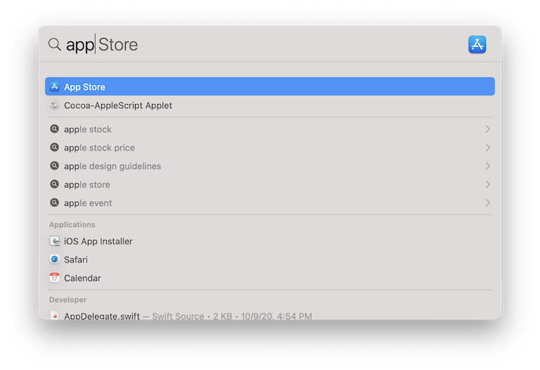

# BaseTen Frontend Take-Home Challenge

For this challenge we are looking to implement a quick-search functionality that mimics
the macOS Spotlight feature. In case you are not familiar with this feature; it is a neat
little UI component that allows you to quickly search for relevant content based on a
search term you input.

For our challenge we are looking to replicate a similar functionality but in the browser
with React that searches against a predetermined list of objects.

This should have taken you to the landing page with requirements/instructions required
to complete the challenge.

## Requirements

Replace the `Placeholder` component with the implementation that you write.

Basic Requirements

- Clicking the _Trigger_ button should launch the UI component to capture user input.
- UI component should consist of a text input as well as an area to display results matching user input.
- Matching results based on the text input are displayed below the text input as a list in alphabetical order by `modified` (most recent modified first).
- Each result should be selectable by mouse click as well as using the{" "} `↑` / `↓` arrow keys (and{" "} `↵`).
- Upon selection, should update the _Selected Output_ area with the selected value.

Nice-to-have Requirements

- Results are grouped by `type` and displayed under an appropriate `type` heading.
- UI component can also be launched via a hotkey combination{" "} `⌘`+`K` or `Ctrl`\+ `K`.
- Hitting the `Esc` key will close the UI component without selecting anything.

Feel free to make assumptions along the way, and just note them in the comments.

## API.ts

To simulate API responses that you would receive from a server, there is an included
`API.ts` file. This file includes a `search(<term>)` function that will return an array
of results given a `term`. The dataset is just a simple collection of popular ML models.

This challenge is meant to be somewhat open-ended. Feel free to make assumptions and
unblock yourself. Just make sure to make a note of all the assumptions as code comments.
